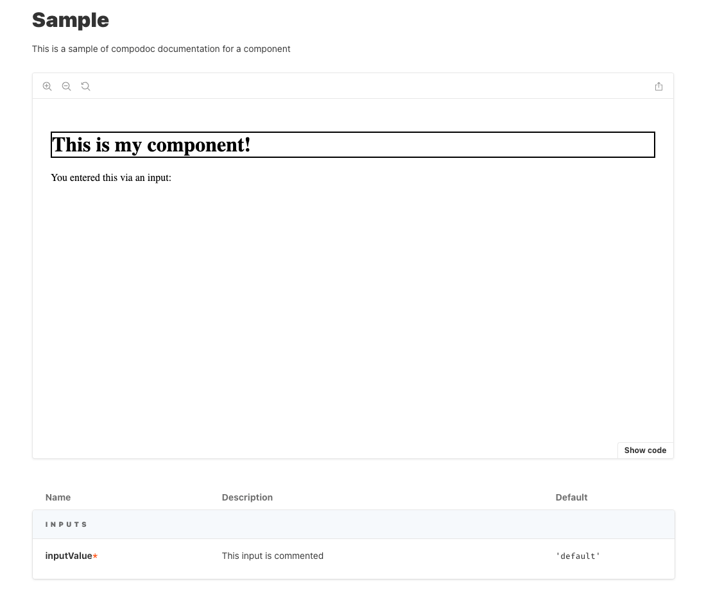
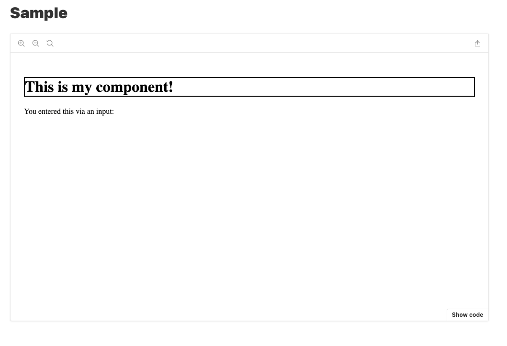

# Storybook Docs Bug Repro

This project was generated with [Angular CLI](https://github.com/angular/angular-cli) version 10.2.1.

## Reproducing the bug

You can see the bug in action by doing the following:

1. Run `npm run storybook` to start the storybook dev server. Look at the docs page for "sample storybook component", the docs will be there:

2. Build static content for storybook via `npm run build-storybook`
3. Serve the page with a simple HTTP server (I used `docker run --rm -v (pwd)/storybook-static/:/usr/share/nginx/html:ro -p 3000:80 --name=storybook-content -d nginx:latest` from the project root)
   and the docs will not show.
   

4. Uncomment the `minimize: true` line in [main.js](.storybook/main.js), then repeat steps 2 and 3. The docs will appear when the content is not minified.
